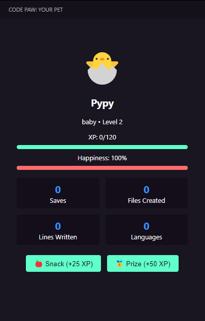

# CodePaw 🐾

Your virtual coding companion that grows with your programming habits!

## Features

- 🐣 **Virtual Pet Evolution**: Watch your pet grow from baby to code legend
- 📊 **Activity Tracking**: Automatically tracks saves, commits, typing, and more
- 🔗 **Git Integration**: Bonus XP for commits, bug fixes, and features
- ⏱️ **Time Tracking**: Milestone rewards for coding sessions
- 🏆 **Achievements System**: Unlock achievements as you code
- 📈 **Detailed Statistics**: Track your coding progress over time

## How it Works

1. Install the extension
2. Start coding as usual
3. Watch your CodePaw grow in the sidebar
4. Earn XP through:
   - File saves (+15 XP)
   - Git commits (+25 XP)
   - Creating files (+20 XP)
   - Debug sessions (+20 XP)
   - Time milestones (+50-100 XP)

## Evolution Stages

- 🐣 **Baby Coder** (Level 1-9)
- 🐱 **Junior Developer** (Level 10-24)
- 🦄 **Senior Developer** (Level 25-49)
- 🐉 **Tech Lead** (Level 50-99)
- ⭐ **Code Legend** (Level 100+)

## Screenshots

## Requirements

- Visual Studio Code 1.100.0 or higher
- Git (for commit tracking)

## Extension Settings

- `codePaw.petName`: Set your pet's name (default: "Pypy")
- `codePaw.autoSave`: Automatically save pet progress (default: true)

## Known Issues

None currently known. Please report issues on GitHub.

## Release Notes

### 1.0.0
- Initial release
- Basic pet evolution system
- Git integration
- Time tracking
- Achievement system

## Contributing

Contributions are welcome! Please feel free to submit a Pull Request.

## License

This extension is licensed under the MIT License.